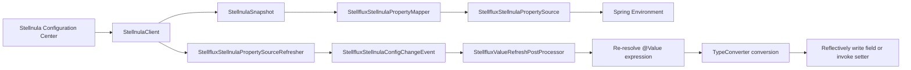
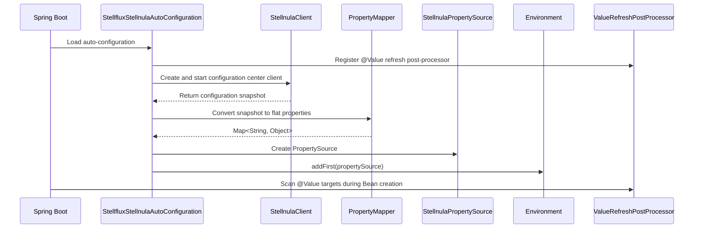
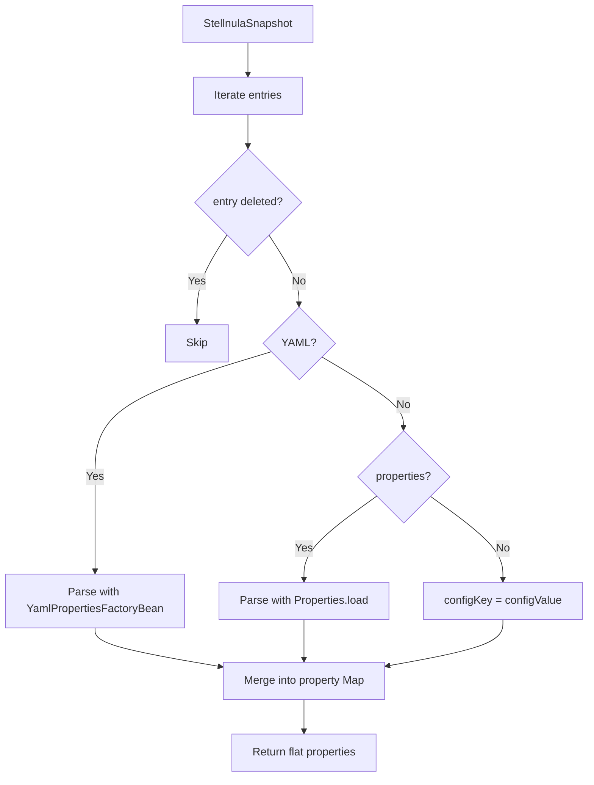
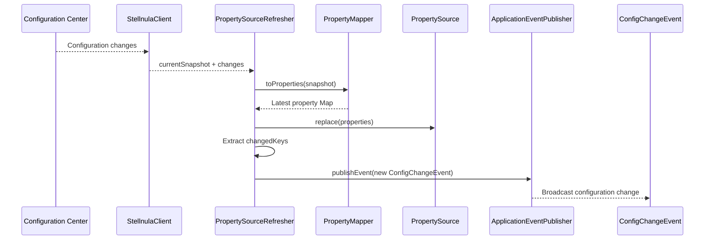
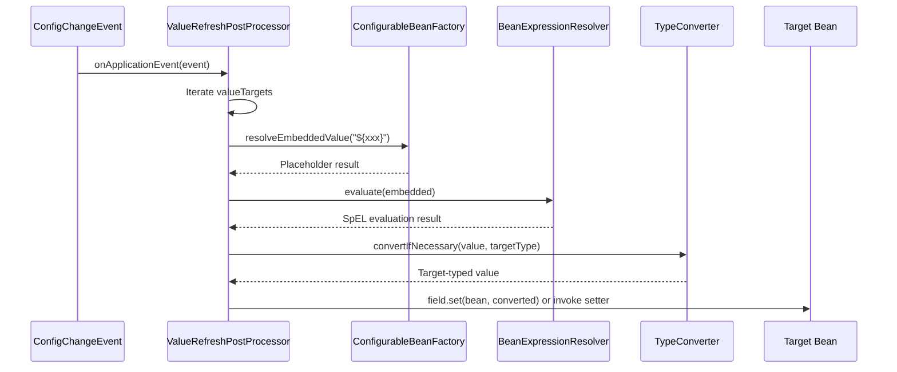
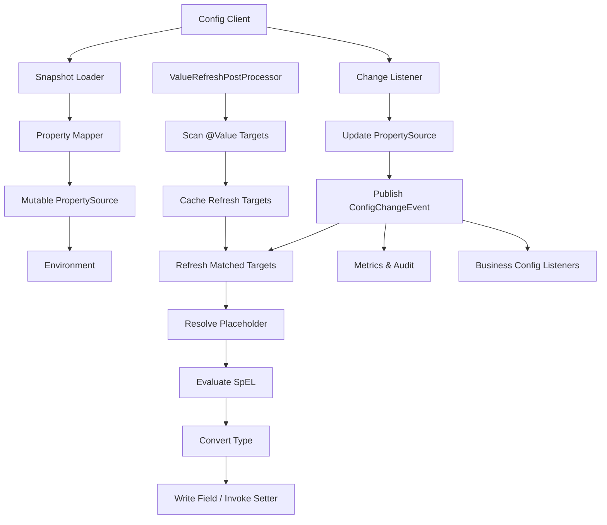

# How Java Makes Dynamically Updated Configuration Center Values Take Effect Under `@Value`: Source Analysis Based on Spring Events

## Abstract

In Spring applications, `@Value` is commonly used to inject external configuration into Bean fields, constructor parameters, or method parameters. By default, `@Value` is resolved during Bean creation and dependency injection. New values pushed later by a configuration center are not automatically written back to already-created Bean instances. Therefore, if the business expects dynamic changes from the configuration center to affect `@Value` fields in existing Beans, an additional runtime refresh mechanism must be built.

From an implementation perspective, common solutions fall into two categories. The first is to use Spring Cloud's `@RefreshScope`, clearing the RefreshScope cache during refresh so the Bean is recreated on the next access. The second updates the Spring `Environment` `PropertySource` after listening to configuration center change events, then scans and writes back `@Value` fields on existing Beans without recreating them. Stellflux's Stellnula module uses the second approach: after the configuration center changes, it replaces the custom `PropertySource`, publishes a custom configuration change event, and finally `StellfluxValueRefreshPostProcessor` listens for that event, re-resolves `@Value` expressions, and writes the new values back to target fields or setter methods.

## Keywords

Spring; Configuration Center; Dynamic Configuration; `@Value`; `PropertySource`; `ApplicationEvent`; `BeanPostProcessor`; `Environment`

## 1. Background: Why `@Value` Does Not Dynamically Take Effect by Default

`@Value` is essentially a dependency injection capability during Spring Bean creation. When Spring creates a Bean, it resolves `${...}` placeholders and `#{...}` SpEL expressions, then injects the resolved result into target fields, constructor parameters, or method parameters through the type conversion mechanism.

This means one key fact: after a normal `@Value` is injected into a Bean field, it is essentially just a normal Java field assignment. Later configuration center updates only mean the new configuration value has entered the configuration system. They do not mean that fields in already-existing JVM objects automatically change.

For example:

```java
@Component
public class DemoService {

    @Value("${demo.timeout:1000}")
    private int timeout;

    public int getTimeout() {
        return timeout;
    }
}
```

After `DemoService` is created, the `timeout` field is already an ordinary `int` value. Even if the configuration center changes `demo.timeout` from `1000` to `2000`, without a refresh mechanism, `DemoService.timeout` still keeps the old value.

Therefore, making `@Value` dynamic requires solving two problems:

First, the new value from the configuration center must enter Spring's configuration resolution system, that is, the `Environment` or a `PropertySource`.

Second, already-created Beans must obtain these new values again. This can be done by recreating the Bean, or by reflectively writing fields or invoking setter methods.

## 2. Overall Design: Event-Driven Dynamic Refresh Chain for `@Value`

The Stellflux design can be abstracted into four layers.

The first layer is the configuration center client, responsible for startup, pulling configuration snapshots, and listening for configuration changes.

The second layer is Spring `PropertySource`, responsible for converting configuration items from the configuration center into properties that Spring can resolve.

The third layer is Spring events, responsible for broadcasting the fact that "configuration has been updated" to internal application components after configuration changes.

The fourth layer is the `@Value` refresh processor, responsible for recording which Beans have refreshable `@Value` fields or methods, and after receiving events, re-resolving expressions, performing type conversion, and writing values back to target Beans.

Overall structure:



The core judgment in this chain is: **configuration center updates are not the endpoint; they are only the starting point of the refresh chain. What truly makes `@Value` take effect is the event listener's second assignment to existing Beans.**

## 3. Source Structure Analysis

The Stellnula auto-configuration directory in Stellflux contains several key classes:

| Class | Responsibility |
| --- | --- |
| `StellfluxStellnulaAutoConfiguration` | Auto-configuration entry point that registers the client, PropertySource, refresher, and `@Value` refresh post-processor |
| `StellfluxStellnulaProperties` | Binds configuration items under the `stellflux.stellnula` prefix |
| `StellfluxStellnulaPropertyMapper` | Converts configuration center snapshots into Spring flat properties |
| `StellfluxStellnulaPropertySource` | Custom Spring `PropertySource` carrying configuration center properties |
| `StellfluxStellnulaPropertySourceRefresher` | Listens to configuration center changes, replaces the PropertySource, and publishes Spring events |
| `StellfluxStellnulaConfigChangeEvent` | Configuration change event carrying changed keys and revision |
| `StellfluxValueRefreshPostProcessor` | Scans, records, and refreshes `@Value` fields or setter methods on Beans |

This structure is clear and reasonably layered. The configuration center SDK does not directly depend on business Beans; business Beans do not need to know that the configuration center exists. The middle is decoupled through `PropertySource` and `ApplicationEvent`.

## 4. Auto-Configuration Stage: Connecting the Configuration Center to Spring Environment

`StellfluxStellnulaAutoConfiguration` is the entry point of the whole mechanism. It does several key things.

First, it registers `StellfluxValueRefreshPostProcessor`. This Bean is declared through a `static @Bean` method so the Bean post-processor can be recognized early by the Spring container and participate in the creation of other Beans.

Second, it creates the `StellnulaClient` and starts the client during Bean creation.

Third, it creates `StellfluxStellnulaPropertySource` based on the client's initial snapshot.

Fourth, it adds the custom `PropertySource` to the `MutablePropertySources` of the Spring `Environment`.

Fifth, it registers `StellfluxStellnulaPropertySourceRefresher` to listen for later configuration center changes.

The key design in the source is converting configuration center data into Spring-native `PropertySource`, instead of writing a separate value retrieval API on the business side. This is important because only after entering the `Environment` can `${...}` placeholder resolution, type conversion, Spring Boot external configuration ordering, and other mechanisms continue to reuse Spring's existing capabilities.

Initialization chain:



One key point is that the `PropertySource` is added through `addFirst`, which means it has high priority during property lookup. This design is suitable when the configuration center should override local default configuration. If a business wants local configuration to take precedence over the configuration center, it cannot simply use `addFirst`; it should explicitly design a priority strategy.

## 5. PropertyMapper: Converting Configuration Center Snapshots into Spring Flat Properties

The configuration center may store single key-value pairs, entire `.properties` files, or YAML files. `StellfluxStellnulaPropertyMapper` converts these different forms into flat properties that Spring can resolve.

Its processing logic can be summarized as:



This step converts a private configuration center model into Spring's public model. Only after this mapping can `@Value("${xxx}")` retrieve configuration center values through Spring's placeholder resolution mechanism.

One issue must be noted during development: expanded YAML and properties files may produce the same key. The current implementation merges into a Map based on iteration order; if multiple configuration items expand into conflicting keys, later values overwrite earlier values. The configuration center side must have a clear conflict governance strategy, otherwise the final value for the same key becomes difficult to troubleshoot.

## 6. PropertySource: Replacing Configuration Snapshots at Runtime

`StellfluxStellnulaPropertySource` extends `EnumerablePropertySource` and maintains a `volatile Map` internally. It provides a `replace` method for replacing the entire current property snapshot when configuration changes.

This design has two characteristics.

First, the read path is simple. `getProperty(name)` directly reads from the current Map.

Second, the update path uses whole-snapshot replacement. A new snapshot is first copied into a new Map, then the reference is replaced. This avoids read threads seeing a half-updated state during traversal or reading.

Structure:


However, this boundary must be clear: updating the `PropertySource` only means that the latest configuration can be read from the `Environment`. It does not mean old values injected into Bean fields automatically change. To change old fields, the `@Value` refresh logic must continue to be triggered.

## 7. Configuration Change Refresher: Listening to the Configuration Center and Publishing Spring Events

`StellfluxStellnulaPropertySourceRefresher` is the turning point of runtime dynamic refresh. It implements three interfaces:

| Interface | Purpose |
| --- | --- |
| `SmartInitializingSingleton` | Registers the configuration listener after all normal singleton Beans are created |
| `ApplicationEventPublisherAware` | Obtains the Spring event publisher |
| `DisposableBean` | Releases the configuration listener registration when the application closes |

Its core logic is:

1. Call `client.listen(...)` in `afterSingletonsInstantiated` to register a configuration center listener.
2. When the configuration center changes, obtain the latest `snapshot` and change list.
3. Use `PropertyMapper` to convert the snapshot into a Spring property Map.
4. Call `propertySource.replace(properties)` to replace the current configuration.
5. Extract changed keys from changes.
6. Publish `StellfluxStellnulaConfigChangeEvent`.

Dynamic refresh chain:



The important design point is that the order must not be wrong. The `PropertySource` must be updated before publishing the event. Because event listeners immediately re-resolve `@Value` expressions after receiving the event, publishing the event before updating the PropertySource may cause listeners to resolve old values.

## 8. Configuration Change Event: Decoupling Configuration Refresh from Bean Refresh

`StellfluxStellnulaConfigChangeEvent` extends Spring `ApplicationEvent` and carries two core fields:

| Field | Meaning |
| --- | --- |
| `keys` | Configuration keys involved in this change |
| `revision` | Version after the configuration center change |

The event object looks simple, but it is the decoupling point of the entire architecture. The configuration center refresher only tells Spring: "configuration has been refreshed; changed keys are these; revision is this." Which Beans need to be reinjected, how injection happens, and how failures are handled are all delegated to event listeners.

This is better than directly operating business Beans inside the configuration center listener. Directly operating business Beans would strongly couple the configuration center SDK, Spring container, and business objects, making it difficult to extend other listener behaviors later, such as audit logging, metric reporting, local cache refresh, and client connection reconstruction.

## 9. `StellfluxValueRefreshPostProcessor`: Making `@Value` on Existing Beans Take Effect Again

`StellfluxValueRefreshPostProcessor` is the most critical class in this mechanism. It plays three roles.

First, it is a `BeanPostProcessor`, scanning `@Value` fields and methods in Beans before initialization.

Second, it is an `ApplicationListener<StellfluxStellnulaConfigChangeEvent>`, executing refresh after configuration change events occur.

Third, it is a `DestructionAwareBeanPostProcessor`, removing cached refresh targets before Bean destruction to avoid retaining invalid references.

It has an internal cache:

```java
private final Map<String, List<ValueTarget>> valueTargets = new ConcurrentHashMap<>();
```

The Map key is `beanName`, and the value is all refreshable `@Value` injection points in that Bean. Each injection point is abstracted as a `ValueTarget`.

### 9.1 Scanning Stage

When a Bean is created, `postProcessBeforeInitialization` executes scanning logic:

```mermaid
flowchart TD
    A[Bean creation] --> B{Infrastructure Bean?}
    B -- Yes --> C[Skip]
    B -- No --> D[Scan fields]
    D --> E{Field has @Value?}
    E -- Yes --> F{Non-static and non-final?}
    F -- Yes --> G[Record FieldValueTarget]
    D --> H[Scan methods]
    H --> I{Method has @Value?}
    I -- Yes --> J{Non-static, one parameter, void return?}
    J -- Yes --> K[Record MethodValueTarget]
    G --> L[valueTargets.put(beanName, targets)]
    K --> L
```

These restrictions are reasonable.

`static` fields do not belong to a specific Bean instance, and dynamically refreshing them can create global side effects.

`final` fields are immutable in Java semantics, and reflectively forcing modification is unreliable.

Method injection only supports single-parameter `void` methods, which is essentially setter-style refresh with clear boundaries.

### 9.2 Initial Refresh Stage

`StellfluxValueRefreshPostProcessor` implements `SmartInitializingSingleton`, so it runs `refreshValueTargets` once after all normal singleton Beans are created.

This initial refresh looks like repeated assignment, but it has practical value: if there is an ordering difference between when the configuration center `PropertySource` is injected into the Environment and when some Beans resolve `@Value`, the initial refresh can recalibrate `@Value` fields after singleton creation finishes.

### 9.3 Event Refresh Stage

When `StellfluxStellnulaConfigChangeEvent` is published, `onApplicationEvent` is triggered and then calls `refreshValueTargets`.

Refresh logic:



This is the real reason `@Value` dynamically takes effect: `@Value` itself does not become dynamic. The framework re-executes "resolve expression + type conversion + injection" after configuration changes.

## 10. Difference from `@RefreshScope`

The idea of `@RefreshScope` is to recreate Beans. During configuration refresh, it clears the target object cache in refresh scope. On the next access to the proxy object, the actual Bean is recreated, so new `@Value` or `@ConfigurationProperties` values take effect during the new Bean creation stage.

The Stellflux approach does not recreate Beans. It modifies existing Bean fields or invokes setter methods. The differences are:

| Dimension | `@RefreshScope` | Event + reflective `@Value` write-back |
| --- | --- | --- |
| Effect mechanism | Clears scope cache and recreates Bean later | Does not recreate Bean; directly modifies existing instance |
| Business code intrusion | Requires `@RefreshScope` annotation | Business Beans only need ordinary `@Value` |
| Constructor injection support | Supported because Bean is recreated | Not supported because constructor is not rerun |
| final field support | Supported on the newly constructed final field | Should not support final fields |
| Impact on stateful Beans | May recreate objects; connections, thread pools, and resource release need consideration | Object is not recreated, but internal state may become inconsistent with new config |
| Atomicity | Bounded by Bean recreation | Multiple fields are refreshed one by one, not naturally atomic |
| Risk points | Proxy, scope, and dependency-chain refresh boundaries are complex | Reflective field writes, thread visibility, and consistency must be controlled |

My judgment is: **if a configuration item affects strongly stateful objects such as clients, connection pools, thread pools, or rate limiters, component reconstruction or explicit lifecycle management should be preferred; if a configuration item is only a normal switch, threshold, text, timeout, or gray percentage, the event + field write-back approach is lighter.**

## 11. Issues That Must Be Considered During Development

### 11.1 Do Not Support Dynamic Refresh for Constructor Injection

This style is not suitable for the current approach:

```java
@Service
public class DemoService {

    private final int timeout;

    public DemoService(@Value("${demo.timeout}") int timeout) {
        this.timeout = timeout;
    }
}
```

The reason is simple: the constructor only executes once during Bean creation. Without recreating the Bean, the constructor cannot execute again. For dynamic configuration, use non-final fields or setter methods.

Recommended style:

```java
@Service
public class DemoService {

    private volatile int timeout;

    @Value("${demo.timeout:1000}")
    public void setTimeout(int timeout) {
        this.timeout = timeout;
    }

    public int getTimeout() {
        return timeout;
    }
}
```

### 11.2 Dynamic Fields Should Use `volatile` or Thread-Safe Containers

Reflective field write-back happens in the configuration listener thread or event handling thread, while business reads happen in request handling threads. If the field is read by multiple threads, use `volatile`, `AtomicReference`, or immutable snapshot objects to ensure visibility.

```java
@Component
public class RateLimitConfig {

    private final AtomicReference<LimitRule> rule = new AtomicReference<>();

    @Value("${limit.rule:default}")
    public void setRule(String rawRule) {
        this.rule.set(parseRule(rawRule));
    }

    public LimitRule currentRule() {
        return rule.get();
    }

    private LimitRule parseRule(String rawRule) {
        // Parse rule from configuration text.
        return new LimitRule(rawRule);
    }
}
```

### 11.3 Do Not Scatter Multiple `@Value` Fields When Multiple Configuration Items Need Consistent Updates

If a business object depends on multiple configuration items that must remain consistent, such as:

```java
@Value("${client.host}")
private String host;

@Value("${client.port}")
private int port;
```

This approach may create a short inconsistent window during refresh. A better approach is to aggregate related configuration into an immutable object and replace the reference once.

```java
@Component
public class ClientConfigHolder {

    private final AtomicReference<ClientConfig> config = new AtomicReference<>();

    @Value("${client.host:localhost}")
    private String host;

    @Value("${client.port:8080}")
    private int port;

    public void rebuild() {
        this.config.set(new ClientConfig(host, port));
    }

    public ClientConfig current() {
        return config.get();
    }
}
```

If consistency requirements are higher, listen to the configuration change event and manually build a complete configuration snapshot, rather than relying on several fields being refreshed independently.

### 11.4 Do Not Refresh Everything for Every Change

The current Stellflux implementation iterates over all recorded `@Value` injection points after an event occurs. This implementation is simple and reliable, but when the number of Beans and `@Value` targets is large, full refresh introduces extra overhead.

A more advanced optimization is to build a reverse index from key to ValueTarget:

```text
demo.timeout -> [DemoService.timeout, OtherBean.timeout]
feature.gray -> [FeatureService.gray]
```

After receiving an event, only targets hit by changedKeys are refreshed. However, this optimization cannot be implemented by simple string containment, because `@Value` may include defaults, SpEL, multiple placeholders, and composite expressions. Accurate indexing requires parsing placeholder expressions.

### 11.5 Configuration Deletion Is Not Simple

If the configuration center deletes a key and the `PropertySource` no longer contains it, `${key:default}` can fall back to the default value. But `${key}` without a default may fail during refresh. Deletion semantics must be defined during development.

Recommended rules:

1. All dynamic configurations must provide default values.
2. Deleting a configuration is equivalent to falling back to the default value, not keeping the old value.
3. Critical configurations cannot be deleted; they can only be modified.
4. If refresh fails, keep the old value and record an alert.

### 11.6 Do Not Refresh Infrastructure Beans

`StellfluxValueRefreshPostProcessor` already excludes itself and `PropertySourceRefresher`. This is necessary. Dynamically refreshing infrastructure Beans can cause recursive refresh, event loops, or corruption of the refresher's own state.

Real projects should also consider excluding:

* `BeanPostProcessor`
* `BeanFactoryPostProcessor`
* `ApplicationEventMulticaster`
* Configuration center Client itself
* Logging system initialization related Beans
* Thread pools, connection pools, and other Beans requiring lifecycle management

### 11.7 Event Listeners Should Not Execute Heavy Logic

Spring event publishing essentially hands events to the event multicaster. Whether event listeners execute synchronously depends on event multicaster configuration. Regardless of sync or async mode, listeners should not execute heavy logic.

`@Value` refresh should be short and only perform expression resolution, type conversion, and field write-back. Complex logic should be handled by business-side lightweight callbacks, delayed reconstruction, or dedicated configuration change handlers.

### 11.8 Type Conversion Failures Must Degrade Gracefully

Dynamic configuration inevitably receives invalid input, such as configuring a number as a string, configuring an enum as a non-existent value, or writing invalid JSON. The refresher must not interrupt the entire application because one field fails.

A more reasonable strategy is:

* If one field refresh fails, record the error and keep the old value.
* Count failures and report alerts.
* Pre-validate critical configuration.
* Perform schema validation before publishing from the configuration center.
* Support gray release and rollback.

### 11.9 Reflective Field Writes Are Not a Universal Solution

Reflective refresh is suitable for simple fields, not all scenarios. The following cases should not rely on reflective write-back:

* Configuration affects object construction logic.
* Configuration affects connection pool initialization.
* Configuration affects thread pool size.
* Configuration affects Netty EventLoop.
* Configuration affects database connections.
* Configuration affects gRPC Channel.
* Configuration affects Bean dependencies.
* The field is final.
* The field value has been copied into other internal objects.

These scenarios should design explicit reload methods, or use `@RefreshScope`, factory Beans, configuration holders, or lifecycle managers.

## 12. Recommended Engineering Implementation

A relatively complete dynamic `@Value` refresh solution should include the following modules:



The minimal implementation needs the following core classes:

| Module | Suggested class name | Description |
| --- | --- | --- |
| Configuration properties | `ConfigCenterProperties` | Binds configuration center address, namespace, and switches |
| Property source | `ConfigCenterPropertySource` | Stores the current configuration snapshot |
| Mapper | `ConfigCenterPropertyMapper` | Converts YAML/properties/key-value into flat properties |
| Refresher | `ConfigCenterPropertySourceRefresher` | Listens to the configuration center and replaces PropertySource |
| Event | `ConfigChangeEvent` | Carries changedKeys, revision, and timestamp |
| Post-processor | `ValueRefreshPostProcessor` | Scans and refreshes `@Value` injection points |
| Metrics | `ConfigRefreshMetrics` | Records refresh count, failure count, and duration |
| Audit | `ConfigRefreshAuditLogger` | Records revision, key, source, and result |

## 13. Recommended Pseudocode

The following pseudocode shows the core event-driven model.

```java
public final class ConfigChangeEvent extends ApplicationEvent {

    private final Set<String> keys;
    private final long revision;

    public ConfigChangeEvent(Object source, Set<String> keys, long revision) {
        super(source);
        this.keys = Set.copyOf(keys);
        this.revision = revision;
    }

    public Set<String> getKeys() {
        return keys;
    }

    public long getRevision() {
        return revision;
    }
}
```

```java
public final class ConfigCenterPropertySource extends EnumerablePropertySource<Map<String, Object>> {

    private volatile Map<String, Object> properties = Map.of();

    public ConfigCenterPropertySource(String name, Map<String, Object> properties) {
        super(name, new LinkedHashMap<>());
        replace(properties);
    }

    public void replace(Map<String, Object> nextProperties) {
        Map<String, Object> copied = new LinkedHashMap<>();
        if (nextProperties != null) {
            copied.putAll(nextProperties);
        }
        this.properties = Map.copyOf(copied);
        getSource().clear();
        getSource().putAll(copied);
    }

    @Override
    public Object getProperty(String name) {
        return properties.get(name);
    }

    @Override
    public String[] getPropertyNames() {
        return properties.keySet().toArray(String[]::new);
    }
}
```

```java
public final class ConfigCenterRefresher implements SmartInitializingSingleton {

    private final ConfigClient client;
    private final ConfigCenterPropertySource propertySource;
    private final ApplicationEventPublisher publisher;

    public ConfigCenterRefresher(
            ConfigClient client,
            ConfigCenterPropertySource propertySource,
            ApplicationEventPublisher publisher) {
        this.client = client;
        this.propertySource = propertySource;
        this.publisher = publisher;
    }

    @Override
    public void afterSingletonsInstantiated() {
        client.listen(change -> {
            Map<String, Object> next = change.toProperties();
            propertySource.replace(next);
            publisher.publishEvent(
                    new ConfigChangeEvent(this, change.keys(), change.revision()));
        });
    }
}
```

```java
public final class ValueRefreshPostProcessor
        implements DestructionAwareBeanPostProcessor,
                   BeanFactoryAware,
                   ApplicationListener<ConfigChangeEvent> {

    private final Map<String, List<ValueTarget>> targets = new ConcurrentHashMap<>();
    private ConfigurableBeanFactory beanFactory;

    @Override
    public void setBeanFactory(BeanFactory beanFactory) {
        if (beanFactory instanceof ConfigurableBeanFactory configurableBeanFactory) {
            this.beanFactory = configurableBeanFactory;
        }
    }

    @Override
    public Object postProcessBeforeInitialization(Object bean, String beanName) {
        List<ValueTarget> found = scanValueTargets(bean, beanName);
        if (!found.isEmpty()) {
            targets.put(beanName, found);
        }
        return bean;
    }

    @Override
    public void onApplicationEvent(ConfigChangeEvent event) {
        for (List<ValueTarget> valueTargets : targets.values()) {
            for (ValueTarget target : valueTargets) {
                target.refresh(beanFactory);
            }
        }
    }

    @Override
    public void postProcessBeforeDestruction(Object bean, String beanName) {
        targets.remove(beanName);
    }

    private List<ValueTarget> scanValueTargets(Object bean, String beanName) {
        // Scan fields and setter methods annotated with @Value.
        return List.of();
    }
}
```

## 14. Conclusion

To make dynamically updated configuration center values take effect under `@Value`, the key is not how the configuration center pushes values, but how a Spring application internally converts "configuration has changed" into "existing Bean state has changed".

The Stellflux implementation path can be summarized as:

1. The configuration center client pulls a snapshot during startup.
2. The snapshot is converted into Spring flat properties.
3. The properties are placed into a custom `PropertySource`.
4. When the configuration center changes, the `PropertySource` is replaced.
5. After replacement, a Spring configuration change event is published.
6. The `@Value` refresh processor listens to the event.
7. The refresh processor re-resolves `@Value` expressions.
8. Spring `TypeConverter` converts the type.
9. Fields are written reflectively or setters are invoked.
10. Existing Beans obtain new configuration values without being recreated.

The biggest value of this approach is low intrusion: business code still uses ordinary `@Value` and does not have to introduce `@RefreshScope`. But it also has clear boundaries: it is not suitable for constructor injection, final fields, strongly stateful objects, or complex configuration requiring atomic whole-object updates. In engineering practice, it is more suitable for normal switches, thresholds, ratios, timeout values, and lightweight strategy parameters. For connection pools, thread pools, clients, and complex dependency objects, explicit reload or Bean reconstruction should be used.
