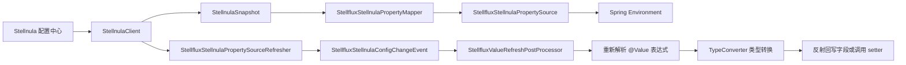
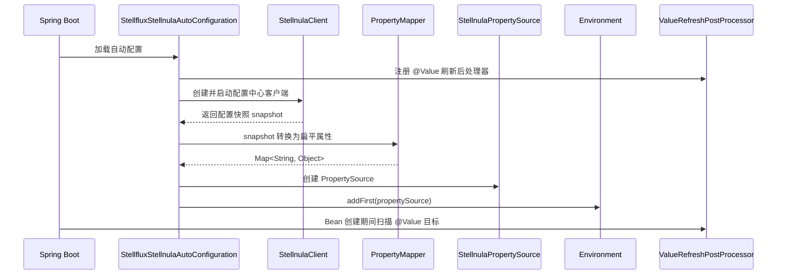
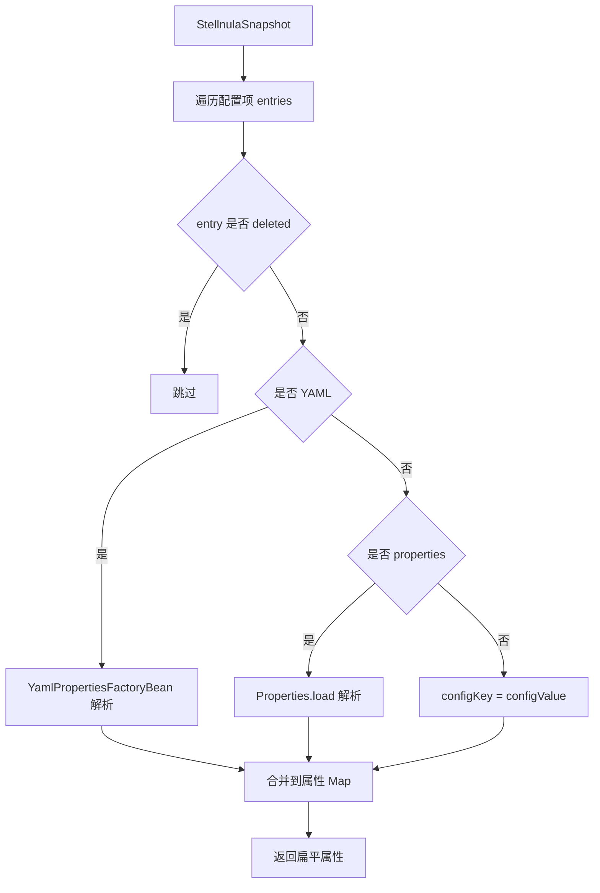
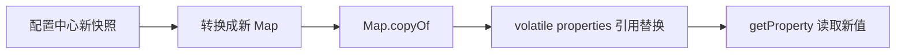
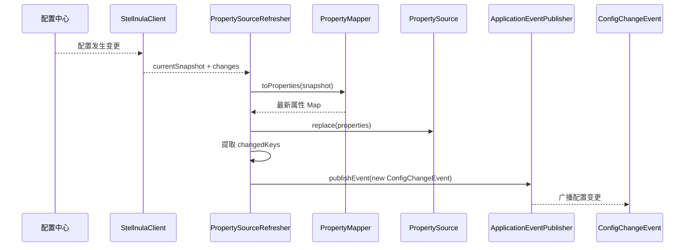
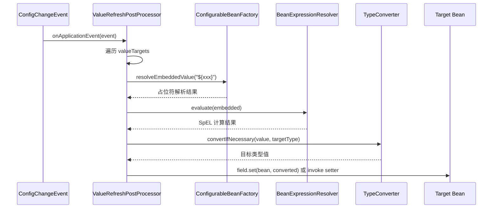
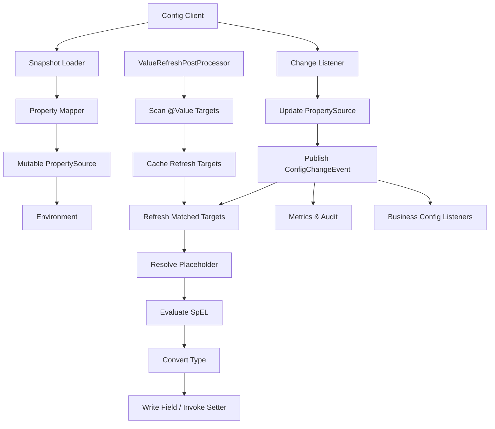

# Java 如何让配置中心动态更新的值在 `@Value` 注解下动态生效：基于 Spring 事件机制的源码分析

## 摘要

在 Spring 应用中，`@Value` 常用于把外部配置注入到 Bean 字段、构造器参数或方法参数中。默认情况下，`@Value` 的解析发生在 Bean 创建和依赖注入阶段，配置中心后续推送的新值不会自动回写到已经创建完成的 Bean 实例中。因此，如果业务希望配置中心的动态变更能够影响已有 Bean 中的 `@Value` 字段，必须额外建立一套运行期刷新机制。

从实现路径看，常见方案有两类。第一类是使用 Spring Cloud 的 `@RefreshScope`，在刷新时清理 RefreshScope 缓存，使 Bean 在下一次访问时重新创建。第二类是在不重建 Bean 的情况下，监听配置中心变更事件，更新 Spring `Environment` 中的 `PropertySource`，再扫描并回写已有 Bean 上的 `@Value` 字段。Stellflux 的 Stellnula 模块采用的是第二类方案：配置中心变更后替换自定义 `PropertySource`，发布自定义配置变更事件，最后由 `StellfluxValueRefreshPostProcessor` 监听事件并重新解析 `@Value` 表达式，把新值写回目标字段或 setter 方法。

## 关键词

Spring；配置中心；动态配置；`@Value`；`PropertySource`；`ApplicationEvent`；`BeanPostProcessor`；`Environment`

## 1. 问题背景：为什么 `@Value` 默认不能动态生效

`@Value` 的本质是 Spring Bean 创建过程中的依赖注入能力。Spring 在创建 Bean 时，会解析 `${...}` 占位符和 `#{...}` SpEL 表达式，然后通过类型转换机制把解析结果注入到目标字段、构造器参数或方法参数中。

这意味着一个关键事实：普通 `@Value` 注入到 Bean 字段之后，本质上只是一次普通 Java 字段赋值。配置中心后续更新了配置，只能说明新的配置值进入了配置系统，并不意味着 JVM 中已经存在的对象字段会自动改变。

例如下面这段代码：

```java
@Component
public class DemoService {

    @Value("${demo.timeout:1000}")
    private int timeout;

    public int getTimeout() {
        return timeout;
    }
}
```

当 `DemoService` 创建完成后，`timeout` 字段已经是一个普通 `int` 值。即使配置中心把 `demo.timeout` 从 `1000` 改成 `2000`，如果没有刷新机制，`DemoService.timeout` 仍然保持旧值。

所以，想让 `@Value` 动态生效，必须解决两个问题：

第一，配置中心的新值必须进入 Spring 的配置解析体系，也就是进入 `Environment` 或 `PropertySource`。

第二，已经创建完成的 Bean 必须重新获得这些新值。实现方式可以是重新创建 Bean，也可以是反射回写字段或调用 setter 方法。

## 2. 总体设计：基于事件驱动的 `@Value` 动态刷新链路

Stellflux 的设计可以抽象为四层：

第一层是配置中心客户端，负责启动、拉取配置快照、监听配置变更。

第二层是 Spring `PropertySource`，负责把配置中心中的配置项转换成 Spring 可以解析的属性。

第三层是 Spring 事件，负责在配置变更后把“配置已经更新”这个事实广播给应用内部组件。

第四层是 `@Value` 刷新处理器，负责记录哪些 Bean 上存在可刷新的 `@Value` 字段或方法，并在收到事件后重新解析表达式、类型转换、回写目标 Bean。

整体结构如下：



这条链路的核心判断是：**配置中心更新不是终点，只是刷新链路的起点。真正让 `@Value` 生效的是事件监听器对已有 Bean 的二次赋值。**

## 3. 源码结构分析

Stellflux 的 Stellnula 自动配置目录中包含几个关键类：

| 类名                                          | 职责                                               |
| ------------------------------------------- | ------------------------------------------------ |
| `StellfluxStellnulaAutoConfiguration`       | 自动装配入口，注册客户端、PropertySource、刷新器和 `@Value` 刷新后处理器 |
| `StellfluxStellnulaProperties`              | 绑定 `stellflux.stellnula` 前缀下的配置项                 |
| `StellfluxStellnulaPropertyMapper`          | 将配置中心快照转换为 Spring 扁平属性                           |
| `StellfluxStellnulaPropertySource`          | 自定义 Spring `PropertySource`，承载配置中心属性             |
| `StellfluxStellnulaPropertySourceRefresher` | 监听配置中心变更，替换 PropertySource，并发布 Spring 事件         |
| `StellfluxStellnulaConfigChangeEvent`       | 配置变更事件，携带变更 key 和 revision                       |
| `StellfluxValueRefreshPostProcessor`        | 扫描、记录并刷新 Bean 上的 `@Value` 字段或 setter 方法          |

这个结构非常清晰，分层是合理的。配置中心 SDK 不直接依赖业务 Bean；业务 Bean 也不需要知道配置中心存在。中间通过 `PropertySource` 和 `ApplicationEvent` 解耦。

## 4. 自动装配阶段：把配置中心接入 Spring Environment

`StellfluxStellnulaAutoConfiguration` 是整个机制的入口。它做了几件关键事情。

第一，注册 `StellfluxValueRefreshPostProcessor`。该 Bean 使用 `static @Bean` 方法声明，目的是让这个 Bean 后处理器尽早被 Spring 容器识别并参与其他 Bean 的创建过程。

第二，创建 `StellnulaClient`，并在 Bean 创建过程中启动客户端。

第三，基于客户端的初始快照创建 `StellfluxStellnulaPropertySource`。

第四，把自定义 `PropertySource` 添加到 Spring `Environment` 的 `MutablePropertySources` 中。

第五，注册 `StellfluxStellnulaPropertySourceRefresher`，用于监听配置中心后续变更。

源码中的关键设计是把配置中心数据转换成 Spring 原生可理解的 `PropertySource`，而不是在业务侧写一套独立的取值 API。这个设计很重要，因为只有进入 `Environment`，`${...}` 占位符解析、类型转换、Spring Boot 外部化配置顺序等机制才能继续复用 Spring 原有能力。

初始化链路如下：



这里有一个非常关键的点：`PropertySource` 被 `addFirst` 加入环境，意味着它在属性查找时拥有较高优先级。这个设计适合配置中心覆盖本地默认配置。如果业务需要本地配置优先于配置中心，就不能简单使用 `addFirst`，而应该明确设计优先级策略。

## 5. PropertyMapper：把配置中心快照转换成 Spring 扁平属性

配置中心里保存的内容可能是单个 key-value，也可能是一整个 `.properties` 文件或 YAML 文件。`StellfluxStellnulaPropertyMapper` 负责把这些不同形式统一转换为 Spring 可以解析的扁平属性。

它的处理逻辑可以概括为：



这一步的本质是把配置中心私有模型转换为 Spring 公共模型。只有完成这个映射，后续 `@Value("${xxx}")` 才能通过 Spring 的占位符解析机制取到配置中心的值。

开发时必须注意一个问题：YAML 和 properties 文件展开后可能产生相同 key。当前实现以遍历顺序合并 Map，如果多个配置项展开后 key 冲突，后写入的值会覆盖先写入的值。配置中心侧必须有明确的冲突治理策略，否则同一个 key 的最终值会变得不容易排查。

## 6. PropertySource：运行期替换配置快照

`StellfluxStellnulaPropertySource` 继承 `EnumerablePropertySource`，内部维护一个 `volatile Map`。它提供 `replace` 方法，用于在配置变化时整体替换当前属性快照。

这个设计有两个特点。

第一，读路径简单。`getProperty(name)` 直接从当前 Map 中读取值。

第二，更新路径采用整体替换。新快照先复制成新的 Map，再替换引用。这样可以避免在读线程遍历或读取时看到半更新状态。

结构如下：



不过这里也要明确边界：`PropertySource` 更新只代表 `Environment` 读取新值时可以拿到最新配置，不代表已经注入到 Bean 字段中的旧值会自动变化。要让旧字段变化，必须继续触发 `@Value` 刷新逻辑。

## 7. 配置变更刷新器：监听配置中心并发布 Spring 事件

`StellfluxStellnulaPropertySourceRefresher` 是运行期动态刷新的转折点。它实现了三个接口：

| 接口                               | 作用                        |
| -------------------------------- | ------------------------- |
| `SmartInitializingSingleton`     | 等所有普通单例 Bean 创建完成后再注册配置监听 |
| `ApplicationEventPublisherAware` | 获取 Spring 事件发布器           |
| `DisposableBean`                 | 应用关闭时释放配置监听注册             |

它的核心逻辑是：

1. 在 `afterSingletonsInstantiated` 中调用 `client.listen(...)` 注册配置中心监听器。
2. 配置中心发生变更时，拿到最新 `snapshot` 和变更列表。
3. 使用 `PropertyMapper` 把 snapshot 转换为 Spring 属性 Map。
4. 调用 `propertySource.replace(properties)` 替换当前配置。
5. 从 changes 中提取变更 key。
6. 发布 `StellfluxStellnulaConfigChangeEvent`。

动态刷新链路如下：



这里的设计重点是顺序不能错。必须先更新 `PropertySource`，再发布事件。因为事件监听器收到事件后会立刻重新解析 `@Value` 表达式，如果事件先发、PropertySource 后更新，那么监听器可能解析到旧值。

## 8. 配置变更事件：让配置刷新与 Bean 刷新解耦

`StellfluxStellnulaConfigChangeEvent` 继承 Spring `ApplicationEvent`，携带两个核心字段：

| 字段         | 含义            |
| ---------- | ------------- |
| `keys`     | 本次变更涉及的配置 key |
| `revision` | 配置中心变更后的版本号   |

事件对象看起来很简单，但它是整个架构的解耦点。配置中心刷新器只负责告诉 Spring：“配置已经刷新，变更 key 是这些，revision 是这个。”至于有哪些 Bean 需要重新注入、如何注入、失败如何处理，都交给事件监听器完成。

这比在配置中心监听器里直接操作业务 Bean 更好。直接操作业务 Bean 会让配置中心 SDK、Spring 容器和业务对象形成强耦合，后续很难扩展其他监听行为，例如记录审计日志、上报指标、刷新本地缓存、重建客户端连接等。

## 9. `StellfluxValueRefreshPostProcessor`：让已有 Bean 的 `@Value` 重新生效

`StellfluxValueRefreshPostProcessor` 是这套机制中最关键的类。它同时承担三个角色：

第一，它是 `BeanPostProcessor`，在 Bean 初始化前扫描 Bean 中的 `@Value` 字段和方法。

第二，它是 `ApplicationListener<StellfluxStellnulaConfigChangeEvent>`，在配置变更事件发生后执行刷新。

第三，它是 `DestructionAwareBeanPostProcessor`，在 Bean 销毁前移除缓存的刷新目标，避免保存无效引用。

它的内部有一个缓存：

```java
private final Map<String, List<ValueTarget>> valueTargets = new ConcurrentHashMap<>();
```

这个 Map 的 key 是 `beanName`，value 是该 Bean 中所有可刷新的 `@Value` 注入点。每个注入点被抽象成一个 `ValueTarget`。

### 9.1 扫描阶段

当 Bean 创建时，`postProcessBeforeInitialization` 会执行扫描逻辑：

```mermaid
flowchart TD
    A[Bean 创建] --> B{是否基础设施 Bean}
    B -- 是 --> C[跳过]
    B -- 否 --> D[扫描字段]
    D --> E{字段是否有 @Value}
    E -- 是 --> F{非 static 且非 final}
    F -- 是 --> G[记录 FieldValueTarget]
    D --> H[扫描方法]
    H --> I{方法是否有 @Value}
    I -- 是 --> J{非 static 且只有一个参数且返回 void}
    J -- 是 --> K[记录 MethodValueTarget]
    G --> L[valueTargets.put(beanName, targets)]
    K --> L
```

这里的限制是合理的。

`static` 字段不属于具体 Bean 实例，动态刷新它会产生全局副作用。

`final` 字段在 Java 语义上代表不可变，反射强行修改并不可靠。

方法注入只支持单参数 `void` 方法，本质上就是 setter 风格刷新，边界清晰。

### 9.2 初始刷新阶段

`StellfluxValueRefreshPostProcessor` 实现了 `SmartInitializingSingleton`，会在所有普通单例 Bean 创建完成后执行一次 `refreshValueTargets`。

这个初始刷新动作看起来像重复赋值，但它有实际意义：如果配置中心 `PropertySource` 注入 Environment 的时机与部分 Bean 的 `@Value` 解析时机存在顺序差异，初始刷新可以在容器完成单例创建后再统一校准一次 `@Value` 字段。

### 9.3 事件刷新阶段

当 `StellfluxStellnulaConfigChangeEvent` 发布后，`onApplicationEvent` 被触发，然后调用 `refreshValueTargets`。

刷新逻辑如下：



这就是 `@Value` 动态生效的真正原因：不是 `@Value` 自己变动态了，而是框架在配置变化后重新执行了一次“解析表达式 + 类型转换 + 注入”的过程。

## 10. 与 `@RefreshScope` 的区别

`@RefreshScope` 的思路是重建 Bean。配置刷新时，它清理 refresh scope 中的目标对象缓存，下一次访问代理对象时重新创建实际 Bean，因此新的 `@Value` 或 `@ConfigurationProperties` 会在新 Bean 创建阶段生效。

Stellflux 这套方案不是重建 Bean，而是修改已有 Bean 的字段值或调用 setter 方法。两者差异如下：

| 维度            | `@RefreshScope`       | 事件 + 反射回写 `@Value`     |
| ------------- | --------------------- | ---------------------- |
| 生效方式          | 清理作用域缓存，后续重新创建 Bean   | 不重建 Bean，直接修改已有实例      |
| 对业务代码侵入       | 需要标注 `@RefreshScope`  | 业务 Bean 只需要普通 `@Value` |
| 对构造器注入支持      | 支持，因为会重建 Bean         | 不支持，因为构造器不会重新执行        |
| 对 final 字段支持  | 支持重新构造后的 final 字段     | 不应支持 final 字段          |
| 对有状态 Bean 的影响 | 可能重建对象，需考虑连接、线程池、资源释放 | 对象不重建，但内部状态可能与新配置不一致   |
| 原子性           | 以 Bean 重建为边界          | 多个字段逐个刷新，不天然保证整体原子     |
| 风险点           | 代理、作用域、依赖链刷新边界复杂      | 反射写字段、线程可见性、一致性需要控制    |

我的判断是：**如果配置项影响的是客户端、连接池、线程池、限流器这类强状态对象，应优先考虑重建组件或显式生命周期管理；如果配置项只是普通开关、阈值、文案、超时时间、灰度比例，事件 + 回写字段的方案更轻量。**

## 11. 开发过程中必须注意的问题

### 11.1 不要支持构造器注入的动态刷新

下面这种写法不适合当前方案：

```java
@Service
public class DemoService {

    private final int timeout;

    public DemoService(@Value("${demo.timeout}") int timeout) {
        this.timeout = timeout;
    }
}
```

原因很简单：构造器只会在 Bean 创建时执行一次。如果不重建 Bean，就无法重新执行构造器。对于动态配置，应该使用非 final 字段或 setter 方法。

推荐写法：

```java
@Service
public class DemoService {

    private volatile int timeout;

    @Value("${demo.timeout:1000}")
    public void setTimeout(int timeout) {
        this.timeout = timeout;
    }

    public int getTimeout() {
        return timeout;
    }
}
```

### 11.2 动态字段建议使用 `volatile` 或线程安全容器

反射回写字段发生在配置监听线程或事件处理线程中，业务读取发生在请求处理线程中。如果字段会被多线程读取，应该使用 `volatile`、`AtomicReference` 或不可变快照对象保证可见性。

例如：

```java
@Component
public class RateLimitConfig {

    private final AtomicReference<LimitRule> rule = new AtomicReference<>();

    @Value("${limit.rule:default}")
    public void setRule(String rawRule) {
        this.rule.set(parseRule(rawRule));
    }

    public LimitRule currentRule() {
        return rule.get();
    }

    private LimitRule parseRule(String rawRule) {
        // Parse rule from configuration text.
        return new LimitRule(rawRule);
    }
}
```

### 11.3 多个配置项需要一致更新时，不要分散写多个 `@Value`

如果一个业务对象依赖多个配置项，并且这些配置项必须保持一致，例如：

```java
@Value("${client.host}")
private String host;

@Value("${client.port}")
private int port;
```

这种方式在刷新时可能出现短暂的不一致窗口。更好的做法是把相关配置聚合成一个不可变对象，然后一次性替换引用。

```java
@Component
public class ClientConfigHolder {

    private final AtomicReference<ClientConfig> config = new AtomicReference<>();

    @Value("${client.host:localhost}")
    private String host;

    @Value("${client.port:8080}")
    private int port;

    public void rebuild() {
        this.config.set(new ClientConfig(host, port));
    }

    public ClientConfig current() {
        return config.get();
    }
}
```

如果对一致性要求更高，应该监听配置变更事件后手动构建完整配置快照，而不是依赖多个字段分别刷新。

### 11.4 不要把所有变更都全量刷新

Stellflux 当前实现会在事件发生后遍历所有记录过的 `@Value` 注入点。这个实现简单、可靠，但当 Bean 数量和 `@Value` 数量很大时，全量刷新会带来额外开销。

更高级的优化方式是建立 key 到 ValueTarget 的反向索引：

```text
demo.timeout -> [DemoService.timeout, OtherBean.timeout]
feature.gray -> [FeatureService.gray]
```

收到事件后，只刷新 changedKeys 命中的目标字段。不过这个优化不能简单通过字符串包含完成，因为 `@Value` 可能包含默认值、SpEL、多个占位符和组合表达式。要做精确索引，需要解析占位符表达式。

### 11.5 配置删除不是简单问题

如果配置中心删除了某个 key，`PropertySource` 中也没有这个 key，那么 `${key:default}` 可以回退到默认值；但 `${key}` 没有默认值时，刷新可能失败。开发时必须规定删除语义。

推荐规则：

1. 所有动态配置必须提供默认值。
2. 删除配置等价于回退默认值，而不是保持旧值。
3. 对关键配置禁止删除，只允许修改。
4. 刷新失败时必须保留旧值并记录告警。

### 11.6 不要刷新基础设施 Bean

`StellfluxValueRefreshPostProcessor` 已经排除了自身和 `PropertySourceRefresher`。这是必要的。动态刷新基础设施 Bean 容易造成递归刷新、事件循环或刷新器自身状态被破坏。

实际项目中还应该考虑排除：

* `BeanPostProcessor`
* `BeanFactoryPostProcessor`
* `ApplicationEventMulticaster`
* 配置中心 Client 自身
* 日志系统初始化相关 Bean
* 线程池、连接池等需要生命周期管理的 Bean

### 11.7 事件监听器不要执行重逻辑

Spring 事件发布本质上是把事件交给事件多播器处理。事件监听器是否同步执行，取决于事件多播器配置。无论同步还是异步，监听器都不应该执行过重逻辑。

`@Value` 刷新本身应该尽量短，只做表达式解析、类型转换和字段回写。复杂逻辑应该在业务侧通过轻量回调、延迟重建或专门的配置变更处理器完成。

### 11.8 类型转换失败必须降级

动态配置一定会出现错误输入，例如把数字配置成字符串，把枚举配置成不存在的值，把 JSON 写成非法格式。刷新器不能因为一个字段失败就中断整个应用。

更合理的策略是：

* 单个字段刷新失败，只记录错误并保留旧值；
* 统计失败次数并上报告警；
* 对关键配置做预校验；
* 配置中心发布前做 schema 校验；
* 支持灰度发布和回滚。

### 11.9 反射写字段不是万能方案

反射刷新适合简单字段，不适合所有场景。以下情况不建议依赖反射回写：

* 配置影响对象构造逻辑；
* 配置影响连接池初始化；
* 配置影响线程池大小；
* 配置影响 Netty EventLoop；
* 配置影响数据库连接；
* 配置影响 gRPC Channel；
* 配置影响 Bean 依赖关系；
* 字段是 final；
* 字段值被复制到了其他内部对象中。

这些场景应该设计显式的 reload 方法，或者通过 `@RefreshScope`、工厂 Bean、配置持有器、生命周期管理器来处理。

## 12. 推荐的工程实现方案

一个比较完整的动态 `@Value` 刷新方案应该包括以下模块：



最小实现需要以下几个核心类：

| 模块   | 建议类名                                  | 说明                                |
| ---- | ------------------------------------- | --------------------------------- |
| 配置属性 | `ConfigCenterProperties`              | 绑定配置中心地址、命名空间、开关                  |
| 属性源  | `ConfigCenterPropertySource`          | 保存当前配置快照                          |
| 映射器  | `ConfigCenterPropertyMapper`          | YAML/properties/key-value 转扁平属性   |
| 刷新器  | `ConfigCenterPropertySourceRefresher` | 监听配置中心并替换 PropertySource          |
| 事件   | `ConfigChangeEvent`                   | 携带 changedKeys、revision、timestamp |
| 后处理器 | `ValueRefreshPostProcessor`           | 扫描并刷新 `@Value` 注入点                |
| 指标   | `ConfigRefreshMetrics`                | 记录刷新次数、失败次数、耗时                    |
| 审计   | `ConfigRefreshAuditLogger`            | 记录 revision、key、来源、结果             |

## 13. 推荐伪代码

下面是核心逻辑伪代码，重点展示事件驱动模型。

```java
public final class ConfigChangeEvent extends ApplicationEvent {

    private final Set<String> keys;
    private final long revision;

    public ConfigChangeEvent(Object source, Set<String> keys, long revision) {
        super(source);
        this.keys = Set.copyOf(keys);
        this.revision = revision;
    }

    public Set<String> getKeys() {
        return keys;
    }

    public long getRevision() {
        return revision;
    }
}
```

```java
public final class ConfigCenterPropertySource extends EnumerablePropertySource<Map<String, Object>> {

    private volatile Map<String, Object> properties = Map.of();

    public ConfigCenterPropertySource(String name, Map<String, Object> properties) {
        super(name, new LinkedHashMap<>());
        replace(properties);
    }

    public void replace(Map<String, Object> nextProperties) {
        Map<String, Object> copied = new LinkedHashMap<>();
        if (nextProperties != null) {
            copied.putAll(nextProperties);
        }
        this.properties = Map.copyOf(copied);
        getSource().clear();
        getSource().putAll(copied);
    }

    @Override
    public Object getProperty(String name) {
        return properties.get(name);
    }

    @Override
    public String[] getPropertyNames() {
        return properties.keySet().toArray(String[]::new);
    }
}
```

```java
public final class ConfigCenterRefresher implements SmartInitializingSingleton {

    private final ConfigClient client;
    private final ConfigCenterPropertySource propertySource;
    private final ApplicationEventPublisher publisher;

    public ConfigCenterRefresher(
            ConfigClient client,
            ConfigCenterPropertySource propertySource,
            ApplicationEventPublisher publisher) {
        this.client = client;
        this.propertySource = propertySource;
        this.publisher = publisher;
    }

    @Override
    public void afterSingletonsInstantiated() {
        client.listen(change -> {
            Map<String, Object> next = change.toProperties();
            propertySource.replace(next);
            publisher.publishEvent(
                    new ConfigChangeEvent(this, change.keys(), change.revision()));
        });
    }
}
```

```java
public final class ValueRefreshPostProcessor
        implements DestructionAwareBeanPostProcessor,
                   BeanFactoryAware,
                   ApplicationListener<ConfigChangeEvent> {

    private final Map<String, List<ValueTarget>> targets = new ConcurrentHashMap<>();
    private ConfigurableBeanFactory beanFactory;

    @Override
    public void setBeanFactory(BeanFactory beanFactory) {
        if (beanFactory instanceof ConfigurableBeanFactory configurableBeanFactory) {
            this.beanFactory = configurableBeanFactory;
        }
    }

    @Override
    public Object postProcessBeforeInitialization(Object bean, String beanName) {
        List<ValueTarget> found = scanValueTargets(bean, beanName);
        if (!found.isEmpty()) {
            targets.put(beanName, found);
        }
        return bean;
    }

    @Override
    public void onApplicationEvent(ConfigChangeEvent event) {
        for (List<ValueTarget> valueTargets : targets.values()) {
            for (ValueTarget target : valueTargets) {
                target.refresh(beanFactory);
            }
        }
    }

    @Override
    public void postProcessBeforeDestruction(Object bean, String beanName) {
        targets.remove(beanName);
    }

    private List<ValueTarget> scanValueTargets(Object bean, String beanName) {
        // Scan fields and setter methods annotated with @Value.
        return List.of();
    }
}
```

## 14. 结论

要让配置中心动态更新的值在 `@Value` 下生效，关键不是配置中心如何推送，而是 Spring 应用内部如何把“配置已变化”转化为“已有 Bean 状态已变化”。

Stellflux 的实现路径可以总结为：

1. 配置中心客户端启动时拉取快照。
2. 快照被转换成 Spring 扁平属性。
3. 属性被放入自定义 `PropertySource`。
4. 配置中心变更时替换 `PropertySource`。
5. 替换完成后发布 Spring 配置变更事件。
6. `@Value` 刷新处理器监听事件。
7. 刷新处理器重新解析 `@Value` 表达式。
8. 通过 Spring `TypeConverter` 转换类型。
9. 通过反射写字段或调用 setter。
10. 已有 Bean 在不重建的情况下获得新配置值。

这个方案最大的价值是低侵入：业务代码仍然使用普通 `@Value`，不必强制引入 `@RefreshScope`。但它也有明确边界：不适合构造器注入、final 字段、强状态对象和需要整体原子更新的复杂配置。工程上更推荐把它用于普通开关、阈值、比例、超时时间、轻量策略参数；对于连接池、线程池、客户端和复杂依赖对象，应使用显式 reload 或 Bean 重建方案。
